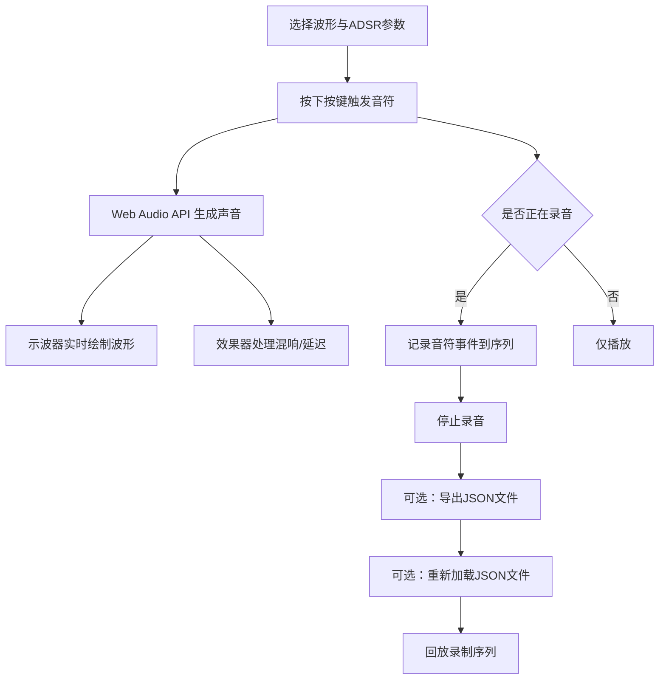

## 1. 产品概述

Web 端虚拟声音合成器，模拟早期模拟合成器的音乐体验。用户可通过鼠标点击或键盘按键触发 8 个音符（C4-C5），自由选择波形与 ADSR 包络参数塑造音色，支持录制、回放、保存/加载演奏片段，并提供实时示波器与混响/延迟效果器。

- **目标用户**：音乐爱好者、电子音乐初学者、音频合成学习者
- **核心价值**：零门槛体验模拟合成器音色设计，在浏览器中完成演奏与录制

## 2. 核心功能

### 2.1 功能模块

1. **音符键盘区**：8 个按键对应 C4 至 C5，支持鼠标点击和键盘数字键 1-8 触发
2. **波形选择器**：4 种波形——正弦波（Sine）、方波（Square）、锯齿波（Sawtooth）、三角波（Triangle）
3. **ADSR 包络面板**：4 个滑块分别控制 Attack、Decay、Sustain、Release 参数
4. **录音与回放**：录制演奏序列（含音符、起始时间、持续时长），支持回放
5. **文件导入/导出**：将录制片段保存为 JSON 文件，支持重新加载
6. **预设音色**：3 种预设——钢琴（Piano）、风琴（Organ）、电子音（Electronic），一键切换波形与包络参数
7. **虚拟示波器**：实时 Canvas 绘制当前音符的波形形状
8. **效果器面板**：混响（Reverb）与延迟（Delay）效果，各带干湿比滑块

### 2.2 页面详情

| 页面名称 | 模块名称 | 功能描述 |
|---------|---------|---------|
| 合成器主页 | 音符键盘区 | 8 个琴键按钮，高亮显示当前按下的按键，支持鼠标按压和键盘 1-8 触发 |
| 合成器主页 | 波形选择器 | 4 个波形选项按钮组，当前选中波形高亮，切换后影响后续所有音符 |
| 合成器主页 | ADSR 包络面板 | 4 个垂直/水平滑块，拖动调整包络参数，数值实时显示 |
| 合成器主页 | 预设选择区 | 3 个预设按钮，点击后自动填充对应的波形和 ADSR 参数 |
| 合成器主页 | 录音控制区 | 录音/停止/回放/清除按钮，录制状态指示灯 |
| 合成器主页 | 文件操作区 | 导出 JSON、导入 JSON 按钮 |
| 合成器主页 | 虚拟示波器 | Canvas 画布实时绘制音频波形，随音符播放动态更新 |
| 合成器主页 | 效果器面板 | Reverb 干湿比滑块、Delay 干湿比与 Delay Time 滑块 |

## 3. 核心流程

## 4. 用户界面设计

### 4.1 设计风格

- **主题**：复古未来主义（Synthwave / Analog Synth），致敬 80 年代模拟合成器硬件
- **主色调**：深黑背景 `#0a0a0f`，霓虹青 `#00f0ff` 作为主强调色，品红 `#ff00aa` 作为辅助强调色
- **辅助色**：琥珀色 `#ffb000` 用于示波器波形，暗紫 `#1a1a2e` 用于面板
- **按钮风格**：略带圆角的扁平按钮，悬停时霓虹发光效果（box-shadow glow）
- **字体**：标题使用等宽/科技感字体（Share Tech Mono），正文使用清晰的无衬线字体
- **布局风格**：面板化卡片布局，模拟硬件合成器的旋钮与滑块面板
- **动效**：按钮按下时的视觉反馈、滑块拖动时的数值变化、示波器波形流动动画、录音指示灯的脉冲闪烁

### 4.2 页面设计概览

| 页面名称 | 模块名称 | UI 元素 |
|---------|---------|---------|
| 合成器主页 | 顶部标题栏 | 品牌名称、合成器型号标识，霓虹发光文字 |
| 合成器主页 | 示波器区域 | 居中大面积 Canvas，琥珀色波形在深色背景上绘制，带网格线 |
| 合成器主页 | 音符键盘区 | 8 个等距排列的琴键按钮，当前按下键霓虹高亮 |
| 合成器主页 | 波形与预设区 | 波形选择按钮组 + 预设按钮组，水平排列 |
| 合成器主页 | ADSR 包络面板 | 4 个带刻度的滑块，标签在上、数值在下 |
| 合成器主页 | 效果器面板 | Reverb 和 Delay 滑块组，水平排列 |
| 合成器主页 | 录音与文件区 | 录音控制按钮组（录制/停止/回放/清除）+ 导入导出按钮 |

### 4.3 响应式设计

- 桌面端优先设计，最大宽度 1200px 居中
- 平板端（<1024px）：面板改为两列布局
- 手机端（<768px）：面板改为单列堆叠，键盘按钮缩小

### 4.4 预设音色参数

| 预设名称 | 波形 | Attack | Decay | Sustain | Release |
|---------|------|--------|-------|---------|---------|
| 钢琴 (Piano) | 三角波 | 0.005s | 0.3s | 0.0 | 1.0s |
| 风琴 (Organ) | 正弦波 | 0.01s | 0.1s | 0.8 | 0.2s |
| 电子音 (Electronic) | 锯齿波 | 0.02s | 0.4s | 0.5 | 0.6s |