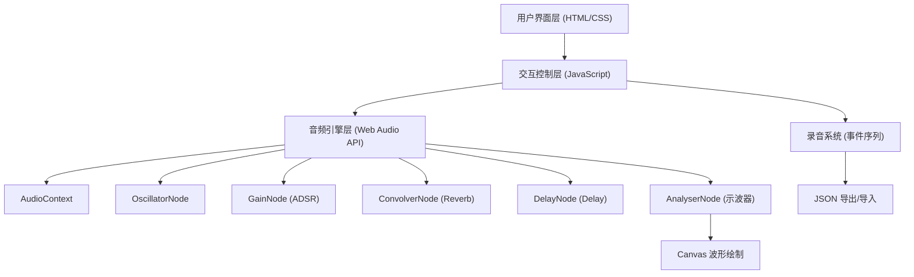
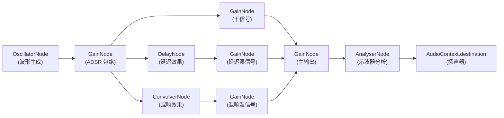

## 1. 架构设计



## 2. 技术选型

- **前端**：原生 HTML5 + CSS3 + ES6 JavaScript（无框架依赖）
- **音频**：Web Audio API（AudioContext, OscillatorNode, GainNode, AnalyserNode, ConvolverNode, DelayNode）
- **示波器**：HTML5 Canvas 2D + requestAnimationFrame
- **文件操作**：FileReader API + Blob/URL 下载
- **构建工具**：无，零依赖纯静态页面

## 3. 路由定义

单页应用，无需路由。

| 路由 | 用途 |
|------|------|
| / (index.html) | 合成器主界面 |

## 4. 数据模型

### 4.1 核心数据结构

```typescript
// 音符事件
interface NoteEvent {
  noteIndex: number;    // 0-7，对应 C4-C5
  frequency: number;    // 音符频率 (Hz)
  startTime: number;    // 录音中的起始时间（秒）
  duration: number;     // 持续时长（秒）
}

// 录制片段
interface Recording {
  version: string;
  bpm: number;
  notes: NoteEvent[];
  createdAt: string;
}

// 音色参数
interface TimbreParams {
  waveform: OscillatorType;  // 'sine' | 'square' | 'sawtooth' | 'triangle'
  attack: number;   // 秒
  decay: number;    // 秒
  sustain: number;  // 0.0 - 1.0
  release: number;  // 秒
}

// 效果器参数
interface EffectsParams {
  reverbWetDry: number;   // 0.0 - 1.0
  delayWetDry: number;    // 0.0 - 1.0
  delayTime: number;      // 秒，0.05 - 1.0
}

// 预设定义
interface Preset {
  name: string;
  waveform: OscillatorType;
  attack: number;
  decay: number;
  sustain: number;
  release: number;
}
```

### 4.2 音符频率表

| 索引 | 音符 | 频率 (Hz) |
|------|------|-----------|
| 0 | C4 | 261.63 |
| 1 | D4 | 293.66 |
| 2 | E4 | 329.63 |
| 3 | F4 | 349.23 |
| 4 | G4 | 392.00 |
| 5 | A4 | 440.00 |
| 6 | B4 | 493.88 |
| 7 | C5 | 523.25 |

## 5. 音频处理流程



## 6. 文件结构

```
1198/
├── index.html          # 主页面，包含完整 HTML 结构
├── css/
│   └── style.css       # 样式表
└── js/
    ├── main.js         # 入口逻辑，事件绑定与初始化
    ├── audioEngine.js  # Web Audio API 封装（振荡器、包络、效果器）
    ├── recorder.js     # 录音与回放逻辑
    ├── oscilloscope.js # Canvas 示波器绘制
    └── presets.js      # 预设音色定义与切换
```